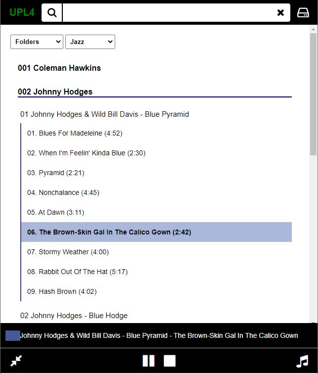

The **UPL96ETL** by ECDesigns is a high-fidelity audio source that plays music files stored on USB drives.  [ECDesigns product page](https://www.ecdesigns.nl/en/blog/upl96etl)

**UPLPlayer** is an alternative application to control playback of the UPL96ETL, with the following features:

- Offers a very simple web interface (folder-based; tags and images are not used) to browse the content of your USB drive(s) and control playback of the UPL

- Albums can be stored on USB drives as "single WAV files" with **cue-sheets**. This allows for more albums to be stored on each drive (max: 98000 albums per drive) and for gapless playback.

The application can run on any Windows or Macintosh computer (Linux version is planned) connected to the UPL96ETL. It should only be used with the latest UPL96ETL firmware (introducing 3-digit folders).

**[Application documentation](./UPLPlayer.pdf)**

**[Application Download](https://drive.google.com/drive/folders/1w9G3euD2XyKdjl2znDo2AxkBYdmLkoP0?usp=sharing)**

Other useful guides (for Windows users only - OSX documentation to be added)

**[Format a drive in FAT32 using Rufus](./Rufus.pdf)**

For Windows users, using Foobar2000 you can quickly copy albums to a USB drive. 

**[Create cue sheets with Foobar2000](./Foobar.pdf)**

Sample web page:

